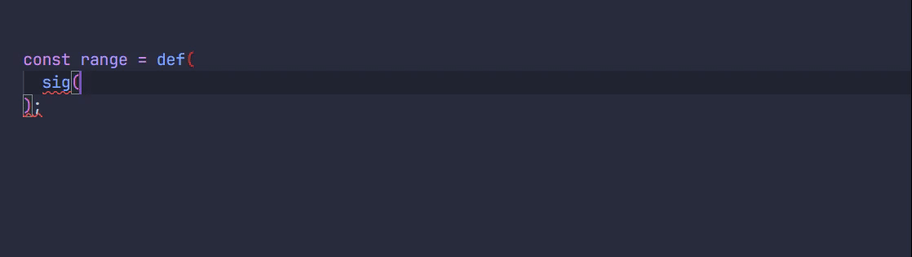

<h1 align="center">Safunc</h1>

<p align="center">
Create <strong><i>runtime-validated</i> functions</strong> with ease, featuring <strong>smart type inference</strong> in TypeScript.
</p>


Have a try on [TS Playground](https://www.typescriptlang.org/play/?#code/JYWwDg9gTgLgBAbzgEwKYDMA0cDOwDm2MAnmKnAMoFwC+c6UEIcARDgIboCuAdgMYsA3AChhfCDxzwo7HvnIBeFBgAUwuHAD0mjQD0A-OtwEVLYDxip5UFthYKAfLdbnL1gNoBdFgEo47HEoCAB4VKQgwAC44Hi4QACNUKD9HGLjEqC8HTCM8fFNXKyTnMwsimzt9QusHAAYSxxLqpK9ff0CqfGCjDTCYdlho2ISk7HCotJGoMcswfSH0pJSHSYyvI2yjbn4YYAk4GTlUPoGYAHkoChgImYj9GdQwOCUARj8EHq0dDT1DH7hxJJ4FJTs9cNcngooXBeGh0OZUMg4Po4LU4NEQbALlcIiJ-uNkfolJjzpcIXiflBUDAuFAeHAAIJQGTEAB0DCYKiQABtUHIYAALaIAWXYgtZfFQwG5Kj6ETgAFpwac-DopI8-DRsCoAPrYYDLZWwOAAajgwDgACpwRqKVrhD4RMJDvJTOgIBBfCIXccACwAJjs8QGXuEQA).

## About

Safunc is a small utility library that allows you to create functions with **runtime validation** of arguments and (optionally) return values, supporting **optional parameters** and **overloaded signatures** with **smart type inference** in TypeScript. It is powered by [Arktype](https://github.com/arktypeio/arktype), an amazing runtime type-checking library using almost 1:1 syntax with TypeScript.



## Installation

```bash
npm install safunc
```

... or any other package manager you prefer!

## Usage

The following shows a minimal example of how to use Safunc to create a type-safe `add` function with runtime validation that only accepts two numbers and returns a number.

```typescript
import { def, sig } from "safunc";

const add = def(sig("number", "number", "=>", "number"), (n, m) => n + m);
//    ^?: Safunc<(n: number, m: number) => number>
add(1, 2); // => 3
add(1); // !TypeError: Expected 2 arguments, but got 1
add("foo", 2); // !TypeError: The 1st argument of 'function(number, number): number' must be a number (was string)

// ... or omit return type if you don't want to validate the return value
const add = def(sig("number", "number"), (n, m) => n + m);
//    ^?: Safunc<(n: number, m: number) => number>
add(1, "foo"); // !TypeError: The 2nd argument of 'function(number, number)' must be a number (was string)
```

You can also define functions with optional parameters and overloaded signatures, which will be detailed later.

```typescript
import { def, sig, optional } from "safunc";

// With optional parameters
const repeat = def(
  //  ^?: Safunc<(s: string, args_1?: { n?: number }) => string>
  sig("string", optional({ "n?": "integer>0" }), "=>", "string"),
  (s, { n = 2 } = {}) => s.repeat(n),
);

// With overloaded signatures and optional parameters
const range = def(
  sig("integer", "=>", "integer[]"),
  sig("integer", "integer", "?integer>0", "=>", "integer[]"),
  function range(startOrStop, stop?, step = 1) {
    // ...
  },
);
```

As you can see here, you can use `def(...signatures, fn)` to create a function with runtime validation. Each signature is composed of several valid [Arktype](https://github.com/arktypeio/arktype) type definitions, split by `=>` to separate parameters and return type. The return type along with `=>` can be omitted if you don't want to validate the return value.

The types of parameters `n` and `m` in the above `add` example are automatically inferred as `number` from its signature, eliminating the need to specify parameter types within the function body. The same is true for `repeatString` and `range` in the examples above.

The `sig` function supports _0-4 parameters_ and 1 optional return type, which should be enough for most cases. If you find it not enough, you’d better consider redesigning your function.

You can use a function expression with name instead of anonymous functions for better error messages:

```typescript
const addIntegers = def(sig("integer", "integer", "=>", "integer"), function add(n, m) {
  return n + m + 0.5; // <- This will throw a TypeError
});
addIntegers(1, 2); // !TypeError: The return value of 'function add(integer, integer): integer' must be an integer (was 3.5)
//                                                              ^^^
//                                       Name of the function is used in the error message
```

### Optional Parameters

Safunc accommodates optional parameters using the `optional` helper function in its signatures.

```typescript
import { def, sig, optional } from "safunc";

const range = def(
  //  ^?: Safunc<(startOrStop: number, stop?: number, step?: number) => number[]>
  sig("integer", optional("integer"), optional("integer>0"), "=>", "integer[]"),
  function range(startOrStop, stop, step = 1) {
    const start = stop === undefined ? 0 : startOrStop;
    stop ??= startOrStop;
    return Array.from({ length: Math.ceil((stop - start) / step) }, (_, i) => start + i * step);
  },
);

range(3); // => [0, 1, 2]
range(1, 5); // => [1, 2, 3, 4]
range(1, "foo"); // !TypeError: The 2nd argument of 'function range(integer, ?integer, ?integer>0): Array<integer>' must be a number (was string)
range(1, 5, -1); // !TypeError: The 3rd argument of 'function range(integer, ?integer, ?integer>0): Array<integer>' must be more than 0 (was -1)
```

The syntax gets a little clumsy, so Safunc offers a shorthand syntax for optional parameters by adding a `?` prefix to the type definition.

```typescript
const range = def(
  //  ^?: Safunc<(startOrStop: number, stop?: number, step?: number) => number[]>
  sig("integer", "?integer", "?integer>0", "=>", "integer[]"),
  function range(startOrStop, stop, step = 1) {
    const start = stop === undefined ? 0 : startOrStop;
    stop ??= startOrStop;
    return Array.from({ length: Math.ceil((stop - start) / step) }, (_, i) => start + i * step);
  },
);
```

This shorthand syntax works well for straightforward string type definitions. For more complex type specifications, the `optional` helper function remains a necessity.

```typescript
const repeat = def(
  //  ^?: Safunc<(s: string, args_1?: { n?: number }) => string>
  sig("string", optional({ "n?": "integer>0" }), "=>", "string"),
  (s, { n = 2 } = {}) => s.repeat(n),
);

repeat("foo", { n: 0.5 }); // !TypeError: Property 'n' of the 2nd argument of 'function(string, ?{ n?: number }): string' must be an integer (was 0.5)
```

### Overloaded Signatures

Safunc supports defining functions with overloaded signatures, which is useful when you want to provide multiple ways to call a function with different sets of parameters.

```typescript
const repeat = def(
  //  ^?: Safunc<((s: string) => string) & ((n: number, s: string) => string)>
  sig("string", "=>", "string"),
  sig("integer>0", "string", "=>", "string"),
  function repeat(...args) {
    const [n, s] = args.length === 1 ? [2, args[0]] : args;
    return s.repeat(n);
  },
);

repeat(); // !TypeError: Expected 1-2 arguments, but got 0
repeat("foo"); // => "foofoo"
repeat(3, "bar"); // => "barbarbar"
repeat(5); // !TypeError: The 1st argument of 'function repeat(string): string' (overload 1 of 2) must be a string (was number)

const concat = def(
  //  ^?: Safunc<((s1: string, s2: string) => string) & ((n: number, m: number) => number)>
  sig("string", "string", "=>", "string"),
  sig("number", "number", "=>", "number"),
  (a, b) => (a as any) + (b as any),
);
concat("foo", "bar"); // => "foobar"
concat(1, 2); // => 3
conact("foo", 42); // 🢇 Error message when length of arguments match multiple signatures
// !TypeError: No overload matches this call.
//   Overload 1 of 2, '(string, string): string', gave the following error.
//     The 2nd argument must be a string (was number)
//   Overload 2 of 2, '(number, number): number', gave the following error.
//     The 1st argument must be a number (was string)
```

While using a single signature preserves the parameter names in the type information (as you can see in earlier examples), providing multiple signatures can obscure them. This _does not_ affect the runtime behavior of functions, but it can make the type information less readable. Despite these challenges, Safunc strives to maintain clear type information by deducing parameter names through [some type-level magic](./src/tools/name-params.ts), resulting in types like `((s: string) => string) & ((n: number, s: string) => string)` for `repeat` and similarly for `concat`.

However, the inferred parameter names may not always meet your expectations:

```typescript
const range = def(
  //  ^?: Safunc<((n: number) => number[]) & ((n1: number, n2: number, n3?: number) => number[])>
  sig("integer", "=>", "integer[]"),
  sig("integer", "integer", "?integer<0|integer>0", "=>", "integer[]"),
  function range(startOrStop, stop?, step = 1) {
    //                        ^^^^^
    // The `?` suffix of `stop?` is required to make the function compatible with overloaded signatures
    const start = stop === undefined ? 0 : startOrStop;
    stop ??= startOrStop;
    const res: number[] = [];
    if (step > 0) for (let i = start; i < stop; i += step) res.push(i);
    else for (let i = start; i > stop; i += step) res.push(i);
    return res;
  },
);

range(); // !TypeError: Expected 1-3 arguments, but got 0
range(3); // => [0, 1, 2]
range(1, "2"); // !TypeError: The 2nd argument of 'function range(integer, integer, ?integer<0|integer>0): Array<integer>' (overload 2 of 2) must be a number (was string)
```

To ensure the parameters are properly named, use `as Sig<...>` to explicitly define the function’s type:

```typescript
import { def, sig, type Sig } from "safunc";

const range = def(
  //  ^?: Safunc<((stop: number) => number[]) & ((start: number, stop: number, step?: number) => number[])>
  sig("integer", "=>", "integer[]") as Sig<(stop: number) => number[]>,
  sig("integer", "integer", "?integer<0|integer>0", "=>", "integer[]") as Sig<
    (start: number, stop: number, step?: number) => number[]
  >,
  function range(startOrStop, stop?, step = 1) {
    /* ... */
  },
);
```

Safunc allows for up to _8 overloaded signatures_ per function.

### Work with Arktype `morph`s

[Arktype](https://github.com/arktypeio/arktype) features a powerful tool called morph, which validates a value and parse it into another value. This is akin to `z.preprocess()` from [Zod](https://github.com/colinhacks/zod), if you are familiar with it.

```typescript
import { morph } from "arktype";

const stringifiablePrimitive = morph("string | number | bigint | boolean | null | undefined", (x) =>
  //  ^?: Type<(In: string | number | bigint | boolean | null | undefined) => Out<string>>
  String(x),
);
stringifiablePrimitive(42); // => { data: "42" }
stringifiablePrimitive(Symbol("foo")); // => { problems: [Problem { message: "Must be a string, a number, a bigint, boolean, null or undefined (was (symbol foo))" }] }

const dateString = morph("string", (x, problems) =>
  //  ^?: Type<(In: string) => Out<Date>>
  isNaN(Date.parse(x)) ? problems.mustBe("a valid date") : new Date(x),
);
dateString("2024-04-06"); // => { data: Date("2024-04-06") }
dateString("foo"); // => { problems: [Problem { message: "Must be a valid date (was 'foo')" }] }
dateString(42); // => { problems: [Problem { message: "Must be a string (was number)" }] }
```

Safunc seamlessly integrates with this feature, accurately inferring types when using `morph`s:

```typescript
const dateString = morph("string", (x, problems) =>
  isNaN(Date.parse(x)) ? problems.mustBe("a valid date") : new Date(x),
);
const isoDateString = morph("Date", (x) => x.toISOString().slice(0, 10));

const addYears = def(
  //  ^?: Safunc<(date: string, years: number) => string>
  sig(dateString, "integer", "=>", isoDateString),
  function addYears(date, years) {
    //     ^?: addYears(date: Date, years: number): Date - Use `Date` inside the function body
    date.setFullYear(date.getFullYear() + years);
    return date;
  },
);
expect(addYears("2024-04-26", 1)).toBe("2025-04-26");
```

In the example above, the implementation of `addYears` operates with types `(date: Date, years: number) => Date`, while its signature specifies `(date: string, years: number) => string`. Conversion between `string` and `Date` is managed by `dateString` and `isoDateString` respectively. Safunc ensures the correct inference of function types both inside and outside the function body.

### Helper methods

The `Safunc` instance contains some helper methods to help you work with the function:

```typescript
const sig1 = sig("integer", "=>", "integer[]") as Sig<(stop: number) => number[]>;
const sig2 = sig("integer", "integer", "?integer>0", "=>", "integer[]") as Sig<
  (start: number, stop: number, step?: number) => number[]
>;
const range = def(sig1, sig2, (startOrStop, stop?, step = 1) => {
  //  ^?: Safunc<((stop: number) => number[]) & ((start: number, stop: number, step?: number) => number[])>
  /* ... */
});

// Use `Safunc#unwrap` to remove helper methods and get the original function
// Note that _validation is still applied_ when calling the unwrapped function
const unwrappedRange = range.unwrap();
//    ^?: ((stop: number) => number[]) & ((start: number, stop: number, step?: number) => number[])

// Use `Safunc#matchArguments` to get the matched `Sig` for the given arguments
range.matchArguments(3); // => sig1
range.matchArguments(1, 5); // => sig2
range.matchArguments("foo"); // => null

// Use `Safunc#assertArguments` to assert the given arguments are valid
range.assertArguments(1, 5); // OK
range.assertArguments("foo"); // !TypeError: The 1st argument of 'function(integer): Array<integer>' (overload 1 of 2) must be a number (was string)

// Use `Safunc#allowArguments` to verify if the given arguments are valid
range.allowArguments(1, 5); // => true
range.allowArguments("foo"); // => false
```

Some properties of the `Safunc` instance are not recommended for use due to their lack of type safety, though they may still be useful in certain situations:

```typescript
// `$sigs` contains all the signatures of the function
range.$sigs; // => [sig1, sig2]
//    ^?: readonly Sig<any>[] - Type safety is not guaranteed

// `$fn` contains the original function without validation
range.$fn;
//    ^?: (...args: never[]) => unknown - Type safety is not guaranteed
```

### Arktype Utilities

Safunc provides some handy utilities to easily define some common schemas with Arktype:

```typescript
import { record, unions } from "safunc";

const recordSchema = record("string", "number");
//    ^?: Type<Record<string, number>>
recordSchema({ foo: 42 }); // => { data: { foo: 42 } }
recordSchema({ foo: "bar" }); // => { problems: [Problem { message: 'Must be an object with values of type \'number\' (was {"foo":"bar"})' }] }

const unionsSchema = unions("string", "number", "boolean");
//    ^?: Type<string | number | boolean>
unionsSchema("foo"); // => { data: "foo" }
unionsSchema(42); // => { data: 42 }
unionsSchema(true); // => { data: true }
unionsSchema({}); // => { problems: [Problem { message: "Must be a string, a number or boolean (was {})" }] }
```

### Using Safunc in Plain JavaScript Files with JSDoc

Using Safunc isn't limited to TypeScript environments. TypeScript supports type annotations in JavaScript through [JSDoc](https://www.typescriptlang.org/docs/handbook/jsdoc-supported-types.html), allowing you to maintain type safety in plain JavaScript files. Since Safunc generally doesn't require explicit type annotations, it works seamlessly in most scenarios.

When dealing with overloaded signatures in JavaScript, you can use JSDoc syntax similar to `as Sig<...>` in TypeScript to achieve clearer type information:

```javascript
import { def, sig } from "safunc";

const range = def(
  //  ^?: Safunc<((stop: number) => number[]) & ((start: number, stop: number, step?: number) => number[])>
  /** @type {import("safunc").Sig<(stop: number) => number[]>} */
  (sig("integer", "=>", "integer[]")),
  /** @type {import("safunc").Sig<(start: number, stop: number, step?: number) => number[]>} */
  (sig("integer", "integer", "?integer>0", "=>", "integer[]")),
  function range(startOrStop, stop, step = 1) {
    /* ... */
  },
);
```

To reduce verbosity, you can define a type alias for `Sig<...>`:

```javascript
/**
 * @template {(...args: never[]) => unknown} F
 * @typedef {import("safunc").Sig<F>} Sig
 */

const range = def(
  //  ^?: Safunc<((stop: number) => number[]) & ((start: number, stop: number, step?: number) => number[])>
  /** @type {Sig<(stop: number) => number[]>} */
  (sig("integer", "=>", "integer[]")),
  /** @type {Sig<(start: number, stop: number, step?: number) => number[]>} */
  (sig("integer", "integer", "?integer>0", "=>", "integer[]")),
  function range(startOrStop, stop, step = 1) {
    /* ... */
  },
);
```

Note that you must enclose `sig(...)` in parentheses to enable TypeScript to recognize it as a type assertion.

Safunc can also be utilized through CDNs and [import maps](https://developer.mozilla.org/docs/Web/HTML/Element/script/type/importmap) in modern browsers:

```html
<!doctype html>
<html lang="en">
  <head>
    <meta charset="UTF-8" />
    <meta name="viewport" content="width=device-width, initial-scale=1.0" />
    <title>Safunc in Browser</title>
    <script type="importmap">
      {
        "imports": {
          "safunc": "https://cdn.jsdelivr.net/npm/safunc@latest/+esm"
        }
      }
    </script>
  </head>
  <body>
    <script type="module">
      import { def, sig } from "safunc";

      const add = def(sig("number", "number", "=>", "number"), (n, m) => n + m);
      console.log(add(1, 2)); // 3
      add(1, "2"); // !TypeError
    </script>
  </body>
</html>
```

This setup is particularly useful in non-standard frontend environments, such as within backend projects that use a templating engine.
